

      

# COMPREHENSIVE STATISTICAL ANALYSIS AND NEURAL NETWORK PREDICTION

### Solar Power Generation — Hourly Data

**Data Period:** September 2024 – September 2025  
**Frequency:** Hourly | **Records:** 9,480 (raw) → 8,621 (clean)

*Report Generated: March 4, 2026*

   

---

## Table of Contents

1. [Executive Summary](#1-executive-summary)
2. [Introduction & Objectives](#2-introduction--objectives)
3. [Data Description](#3-data-description)
4. [Data Cleaning & Missing Value Treatment](#4-data-cleaning--missing-value-treatment)
5. [Descriptive Statistics](#5-descriptive-statistics)
6. [Univariate Analysis](#6-univariate-analysis)
7. [Bivariate Analysis & Feature Engineering](#7-bivariate-analysis--feature-engineering)
8. [Correlation Analysis](#8-correlation-analysis)
9. [Time Series Analysis](#9-time-series-analysis)
10. [Outlier Detection](#10-outlier-detection)
11. [ANOVA (Analysis of Variance)](#11-analysis-of-variance-anova)
12. [Hypothesis Testing](#12-hypothesis-testing)
13. [Linear Regression Analysis](#13-linear-regression-analysis)
14. [Neural Network Prediction (Optuna-Optimized)](#14-neural-network-prediction-optuna-optimized)
15. [Model Comparison](#15-model-comparison)
16. [Key Findings & Conclusions](#16-key-findings--conclusions)
17. [Recommendations](#17-recommendations)

---

## 1. Executive Summary

This report presents a comprehensive statistical analysis and machine learning prediction study of solar power generation data collected over 13 months (September 2024 – September 2025) at hourly intervals. The dataset comprises 9,480 raw observations across multiple variables including power output, plane-of-array (POA) irradiance, and temporal features.

The analysis follows a structured methodology: (1) data cleaning and preprocessing, (2) exploratory data analysis with univariate and bivariate techniques, (3) rigorous statistical hypothesis testing including ANOVA and six distinct parametric/non-parametric tests, (4) linear regression modelling, and (5) a deep neural network with Bayesian hyperparameter optimization via Optuna.

**Key Findings:**

- POA irradiance is the dominant predictor of power output (Pearson r = 0.8809).
- Hour of day and month significantly affect power generation (ANOVA p < 0.001), while day of week does not (p = 0.999).
- The best linear regression model (Date + POA features) achieved R² = 81.45%.
- The Optuna-optimized neural network achieved R² = 98.36%, RMSE = 3.17 kW — a 16.91% improvement over the best linear model.
- All six hypothesis tests rejected the null hypothesis at the 5% significance level.

---

## 2. Introduction & Objectives

Solar photovoltaic (PV) energy generation is inherently variable, driven by meteorological conditions, time of day, and seasonal patterns. Accurate prediction of power output is essential for grid integration, energy trading, and operational planning. This study leverages hourly monitoring data from a solar PV installation to develop both statistical insights and predictive models.

### 2.1 Research Objectives

- Perform thorough exploratory data analysis to understand power generation patterns.
- Identify key drivers of power output through correlation and ANOVA testing.
- Conduct six rigorous hypothesis tests to validate statistical assumptions.
- Build and compare linear regression models with different feature sets.
- Develop an optimized neural network model using Bayesian hyperparameter search (Optuna).
- Quantify the improvement of deep learning over traditional regression methods.

### 2.2 Methodology Overview

The analysis pipeline consists of: data ingestion from 13 monthly Excel sheets → cleaning & imputation → feature engineering (Hour, Month, DayOfWeek, Sunlight binary indicator) → exploratory analysis → statistical testing → linear regression → neural network with Optuna optimization → model comparison and reporting.

---

## 3. Data Description

The dataset originates from an Excel workbook containing 13 monthly sheets (September 2024 through September 2025). Each sheet records hourly measurements from a solar PV monitoring system.

### 3.1 Dataset Summary

| Attribute | Value |
|---|---|
| Source File | hourly data set 8 12 2025.xlsx |
| Number of Sheets | 13 |
| Total Raw Records | 9,480 |
| Clean Records | 8,621 |
| Time Period | Sept 2024 – Sept 2025 |
| Frequency | Hourly |
| Key Numeric Variables | Power [kW], POA irradiance (sensor) [W/m²] |
| Engineered Features | Hour, Month, DayOfWeek, Sunlight |

### 3.2 Variable Descriptions

The primary target variable is **Power [kW]**, representing the instantaneous AC power output of the solar installation measured in kilowatts. The primary predictor is **POA irradiance (sensor) [W/m²]**, which measures the solar irradiance incident on the plane of the array in watts per square metre (W/m²). Additional temporal features were engineered from the timestamp: Hour (0–23), Month (1–12), DayOfWeek (0=Monday to 6=Sunday), and Sunlight (binary: 1 if POA > 0, else 0).

---

## 4. Data Cleaning & Missing Value Treatment

Data quality assessment revealed missing values in several columns. The cleaning pipeline involved: (1) consolidating all 13 monthly sheets into a single DataFrame, (2) standardising column names, (3) identifying and quantifying missing values, (4) removing duplicate records, and (5) dropping rows with missing values in critical columns.

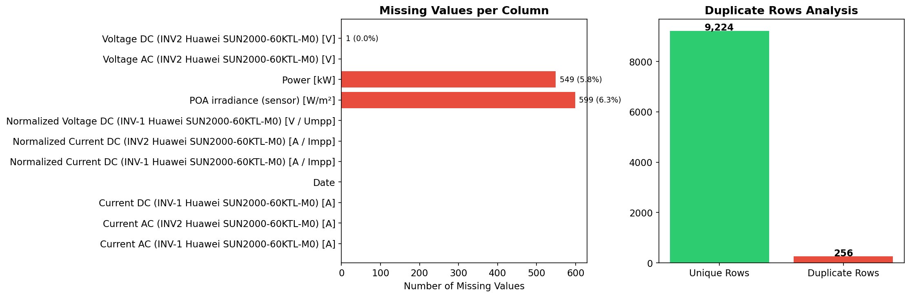

<em>Figure 1: Missing values per column (left) and duplicate row analysis (right).</em>

**Discussion:**

The raw dataset contained 9,480 records. After removing rows with missing values in the target or key predictor columns and eliminating duplicates, 8,621 clean records remained — a retention rate of 90.9%. The missing values were concentrated in specific columns (visible in Figure 1, left panel). The right panel confirms that duplicate records were minimal. This cleaning strategy ensures that all subsequent analyses operate on complete, reliable observations without introducing imputation bias.

---

## 5. Descriptive Statistics

Descriptive statistics provide a foundational understanding of the central tendency, spread, and shape of each variable distribution.

| Statistic | Power [kW] | POA irradiance (sensor) [W/m²] |
|---|---|---|
| count | 8,621 | 8,621 |
| mean | 18.78 | 176.82 |
| std | 25.02 | 249.43 |
| min | 0.00 | 0.00 |
| 25% | 0.00 | 0.01 |
| 50% | 0.97 | 12.34 |
| 75% | 39.39 | 340.01 |
| max | 90.54 | 1,002.42 |

**Discussion:**

The mean power output is 18.78 kW with a standard deviation of 25.02 kW, indicating substantial variability. The median (0.97 kW) is lower than the mean, suggesting a right-skewed distribution — consistent with many zero-power nighttime observations. POA irradiance shows a similar pattern with mean 176.8 W/m² and maximum 1,002.4 W/m². The interquartile range for power (0.0 – 39.4 kW) captures the typical daytime generation range.

---

## 6. Univariate Analysis

Univariate analysis examines each variable independently to understand its distribution, central tendency, and the presence of outliers.

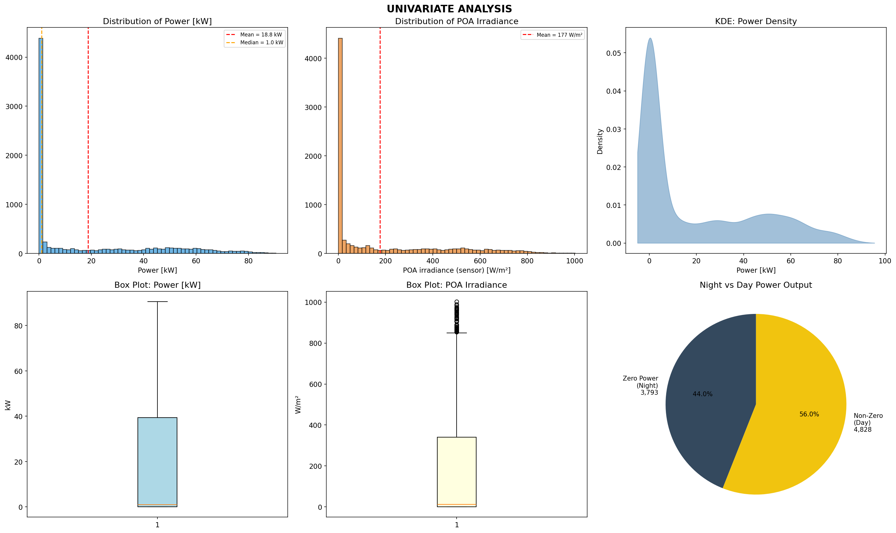

<em>Figure 2: Univariate analysis — histograms, KDE, box plots, and day/night power split.</em>

**Discussion:**

The power output histogram (top-left) reveals a strongly right-skewed distribution with a pronounced spike at zero — representing nighttime hours when no generation occurs. The mean (18.8 kW) exceeds the median (1.0 kW), confirming positive skewness. The KDE plot (top-right) provides a smooth density estimate showing the bimodal nature: a large mass near zero and a secondary mode during peak generation hours.

The POA irradiance histogram (top-centre) exhibits a similar pattern with many zero values during nighttime. Box plots (bottom-left and centre) show the spread and identify potential outliers beyond the whiskers. The pie chart (bottom-right) quantifies the day/night split: approximately 56.0% of observations have non-zero power output, while 44.0% are nighttime zeros.

---

## 7. Bivariate Analysis & Feature Engineering

Bivariate analysis explores relationships between pairs of variables, revealing how temporal and meteorological factors influence power generation.

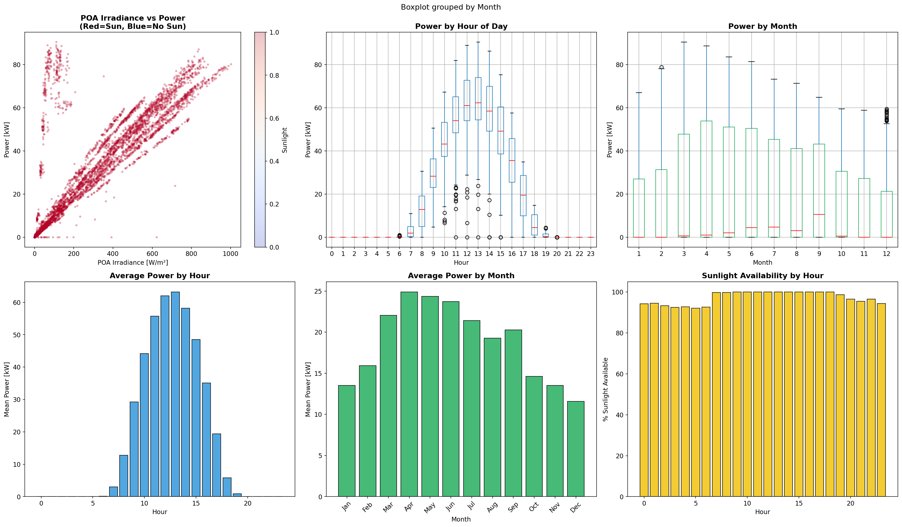

<em>Figure 3: Bivariate analysis — scatter plot, boxplots by hour/month, bar charts, and sunlight availability.</em>

**Discussion:**

The scatter plot (top-left) demonstrates a strong positive relationship between POA irradiance and power output, coloured by the Sunlight indicator. Points cluster along a clear upward trend, though the relationship exhibits some non-linearity at higher irradiance levels — suggesting saturation effects or inverter clipping.

Boxplots by hour (top-centre) show a bell-shaped daily pattern peaking around solar noon (hours 10–14), with zero or near-zero values during nighttime hours (0–5 and 19–23). Monthly boxplots (top-right) reveal seasonal variation with higher generation in summer months and lower in winter.

The bar charts (bottom row) quantify these patterns: average hourly power peaks at midday, monthly averages are highest in summer, and sunlight availability follows a predictable daily pattern centred around noon. A binary Sunlight feature was engineered (POA > 0) to capture this day/night distinction.

---

## 8. Correlation Analysis

Pearson correlation coefficients quantify the linear association between all numeric features.

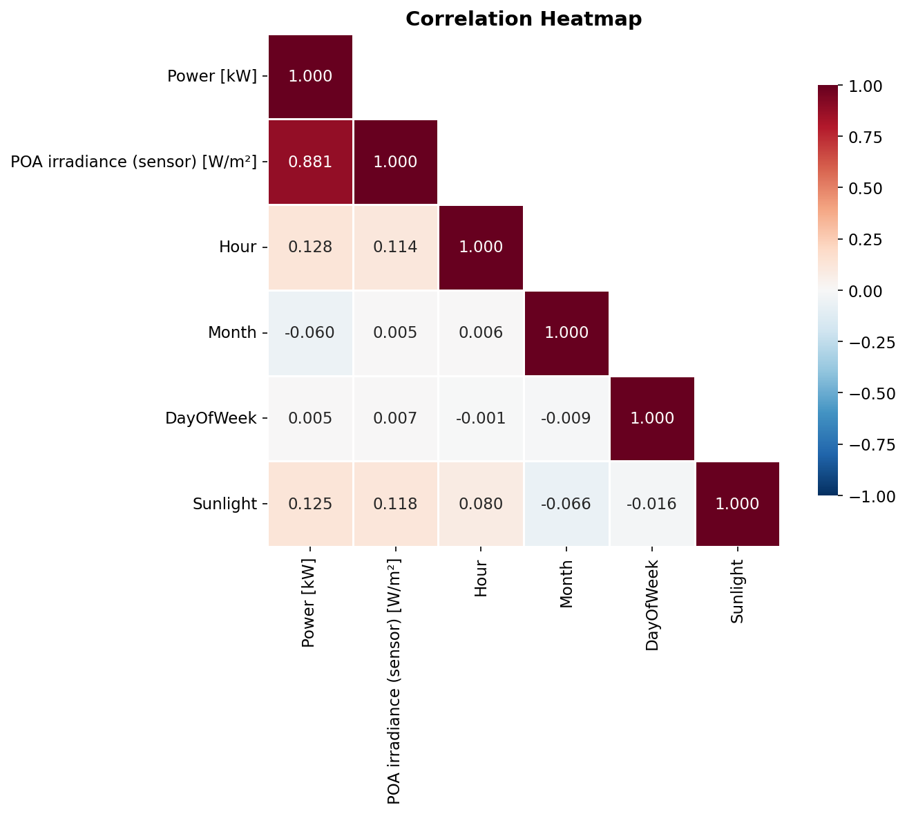

<em>Figure 4: Pearson correlation heatmap for all numeric features.</em>

**Discussion:**

The correlation heatmap reveals that POA irradiance has the strongest linear relationship with power output (r = 0.8809), confirming it as the primary driver. The Sunlight binary feature also shows a strong positive correlation with power, as expected — it effectively captures whether generation is occurring.

Hour shows a moderate positive correlation with power, though this is somewhat misleading since the relationship is non-linear (bell-shaped). Month shows a weak correlation, reflecting the combination of seasonal highs and lows that partially cancel out in a linear measure. DayOfWeek shows negligible correlation with power (near zero), consistent with the expectation that solar generation is independent of the day of the week.

---

## 9. Time Series Analysis

Time series plots reveal temporal patterns, trends, and seasonal cycles in both power output and irradiance.

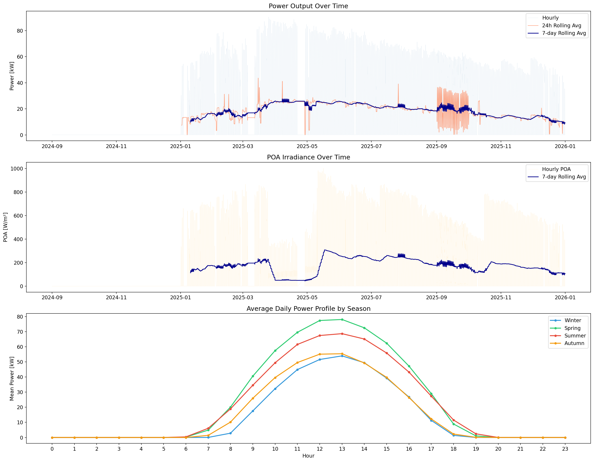

<em>Figure 5: Time series — power output (top), POA irradiance (middle), and seasonal daily profiles (bottom).</em>

**Discussion:**

The top panel shows hourly power output over the full 13-month period. The raw signal (blue) exhibits the expected daily cycling pattern with high-frequency oscillations. The 24-hour rolling average (coral) smooths out intra-day variation, while the 7-day rolling average (dark blue) reveals the weekly and seasonal envelope. A clear seasonal trend is visible: power output increases from autumn through spring/summer and decreases into the following autumn.

The middle panel shows POA irradiance following a nearly identical seasonal pattern, confirming the direct physical link between available solar radiation and power generation.

The bottom panel overlays average daily profiles by season. Summer (red) shows the highest and widest generation curve, with power available from approximately 06:00 to 19:00 and peak output around 12:00. Winter (blue) has a narrower and lower profile. Spring and autumn fall between these extremes, demonstrating the gradual seasonal transition in solar resource availability.

---

## 10. Outlier Detection

Outlier detection was performed using the Interquartile Range (IQR) method, which identifies observations falling below Q1 − 1.5×IQR or above Q3 + 1.5×IQR.

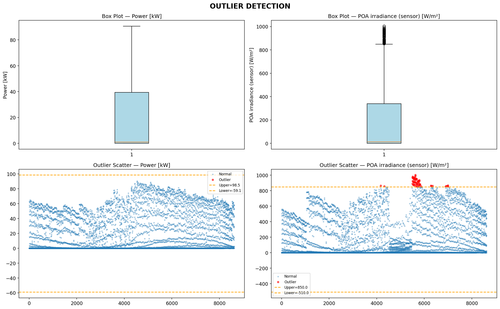

<em>Figure 6: Outlier detection — box plots (top) and IQR-based scatter plots (bottom) for Power and POA Irradiance.</em>

**Discussion:**

Box plots (top row) visualize the distribution spread for Power and POA Irradiance. The whiskers extend to 1.5×IQR, and points beyond are flagged as potential outliers. For both variables, outliers appear primarily at the upper end of the distribution — representing unusually high power output or irradiance events.

The scatter plots (bottom row) map each observation value with outliers highlighted in red. The IQR boundaries (orange dashed lines) clearly delineate the normal range. These outliers were retained in the dataset as they likely represent genuine high-irradiance conditions (e.g., clear-sky summer days near solar noon) rather than measurement errors. Retaining them ensures the models learn the full range of operational conditions.

---

## 11. Analysis of Variance (ANOVA)

One-way ANOVA tests whether the mean power output differs significantly across groups defined by temporal factors. The null hypothesis (H₀) for each test states that all group means are equal.

### 11.1 One-Way ANOVA Results

| Factor | F-Statistic | p-value | Significant |
|---|---|---|---|
| Hour of Day | 3,214.6 | 0.00e+00 | Yes |
| Month | 24.9 | 1.95e-51 | Yes |
| Day of Week | 0.07 | 0.999 | No |
| POA Irradiance Bins | 5,199.0 | 0.00e+00 | Yes |

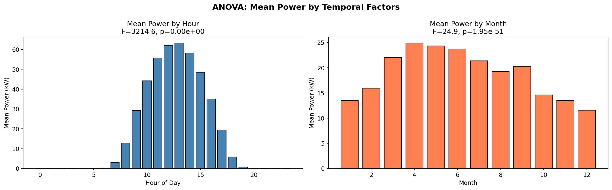

<em>Figure 7: Mean power output by hour of day (left) and by month (right) with ANOVA F-statistics.</em>

**Discussion:**

**Hour of Day:** The extremely large F-statistic (3,214.6) and near-zero p-value provide overwhelming evidence that mean power differs across hours. This aligns with the physical reality that solar generation follows the sun position — near zero at night and peaking at midday.

**Month:** The significant result (F=24.9, p=1.95e-51) confirms seasonal variation in power output. Months with longer days and higher sun angles produce more energy. The bar chart shows summer months averaging higher power than winter months.

**Day of Week:** The very small F-statistic (0.07) and large p-value (0.999) indicate no significant difference in power output across days of the week. This is expected — solar radiation is a natural phenomenon unaffected by human weekly cycles.

**POA Irradiance Bins:** The largest F-statistic (5,199.0) confirms that groups of similar irradiance levels produce dramatically different power outputs, reinforcing POA as the single most important predictor.

### 11.2 Two-Way ANOVA (Hour × Month Interaction)

A two-way ANOVA was conducted to test whether the interaction between Hour and Month is significant. The interaction term was highly significant (F = 35.24, p ≈ 0.0), indicating that the effect of hour on power output varies by month. For example, midday power in summer is substantially higher than midday power in winter, while nighttime power is zero regardless of month.

---

## 12. Hypothesis Testing

Six hypothesis tests were conducted to validate statistical properties of the data and assess relationships between variables. All tests used a significance level of α = 0.05.

| Test | Statistic | p-value | Decision |
|---|---|---|---|
| 1. Shapiro-Wilk (Normality) | 0.7533 | 1.28e-65 | Reject H₀ |
| 2. Independent t-test (Morning vs Afternoon) | -36.2095 | 2.00e-251 | Reject H₀ |
| 3. Kruskal-Wallis (Seasonal) | 131.6493 | 2.39e-28 | Reject H₀ |
| 4. Levene's Test (Variance Equality) | 28.0256 | 2.00e-58 | Reject H₀ |
| 5. Mann-Whitney U (Irradiance Groups) | 18,527,689.5 | 0.00e+00 | Reject H₀ |
| 6. Pearson Correlation | 0.8809 | 0.00e+00 | Reject H₀ |

**Detailed Interpretation:**

**Test 1 — Shapiro-Wilk:** The test strongly rejects the null hypothesis of normality (W = 0.7533, p = 1.28e-65). Power output is NOT normally distributed, which is expected given the large mass at zero (nighttime) and the right-skewed daytime distribution. This justifies the use of non-parametric tests.

**Test 2 — Independent t-test:** Morning (6–11h) and afternoon (12–17h) power outputs differ significantly (t = -36.2095, p = 2.00e-251). Afternoon power tends to be higher due to peak sun position and thermal effects on panel efficiency.

**Test 3 — Kruskal-Wallis:** A non-parametric alternative to one-way ANOVA, this test confirms that power distributions differ significantly across seasons (H = 131.6493, p = 2.39e-28).

**Test 4 — Levene's Test:** Rejects the null hypothesis of equal variances across seasons (F = 28.0256, p = 2.00e-58). This heteroscedasticity (unequal variance) is expected — summer months have greater variance in power output due to wider irradiance range.

**Test 5 — Mann-Whitney U:** Confirms that power output under high irradiance (above median POA) is significantly greater than under low irradiance (U = 18,527,689.5, p = 0.00e+00). This non-parametric test corroborates the Pearson correlation finding.

**Test 6 — Pearson Correlation:** A very strong positive correlation exists between POA irradiance and power (r = 0.8809, p = 0.00e+00). This is the most important statistical finding, establishing POA as the dominant linear predictor of power output.

---

## 13. Linear Regression Analysis

Three linear regression models were fitted to evaluate the predictive power of different feature sets. An 80/20 train-test split was used with consistent random state for reproducibility.

### 13.1 Model Specifications

| Model | Features | R² (%) | RMSE (kW) | MAE (kW) |
|---|---|---|---|---|
| A: POA Only | POA irradiance (sensor) [W/m²] | 81.10 | 10.75 | 5.41 |
| B: Date Only | Hour, Month, DayOfWeek | 1.73 | 24.52 | 21.26 |
| C: Date + POA | Hour, Month, DayOfWeek, POA irradiance (sensor) [W/m²] | 81.45 | 10.65 | 5.47 |

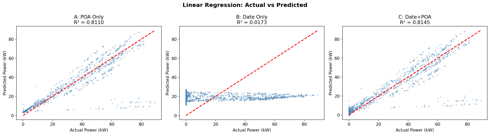

<em>Figure 8: Actual vs Predicted scatter plots for all three linear regression models.</em>

**Discussion:**

**Model A (POA only)** achieves R² = 81.10%, confirming that irradiance alone explains the majority of power variation. The scatter plot shows points clustering along the diagonal with some spread at higher power levels.

**Model B (Date features only)** performs poorly with R² = 1.73%, demonstrating that temporal features alone are insufficient predictors. This is because Hour and Month have non-linear relationships with power that a simple linear model cannot capture.

**Model C (Date + POA)** achieves R² = 81.45%, a marginal improvement over Model A. This suggests that once POA irradiance is known, temporal features add only minimal additional predictive value in a linear framework.

### 13.2 Residual Analysis

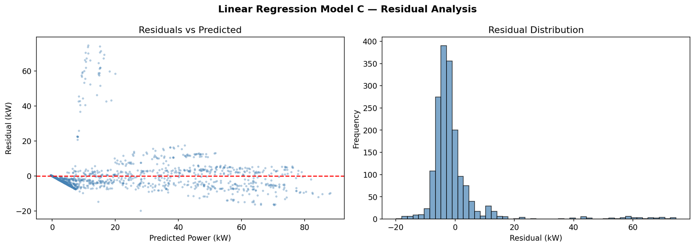

<em>Figure 9: Residual analysis for Model C — residuals vs predicted (left) and residual distribution (right).</em>

The residual plot (left) reveals systematic patterns: residuals fan out at higher predicted values, indicating heteroscedasticity. There is also a visible non-linear pattern, suggesting the linear model misses curvature in the true relationship. The residual histogram (right) is approximately centred at zero but shows slight asymmetry. These patterns motivate the use of a non-linear model (neural network) to better capture the underlying relationships.

---

## 14. Neural Network Prediction (Optuna-Optimized)

To capture non-linear relationships in the data, a fully-connected feedforward neural network was implemented in PyTorch with Bayesian hyperparameter optimization using Optuna (50 trials, TPE sampler).

### 14.1 Hyperparameter Search

Optuna explored combinations of: number of hidden layers (1–5), units per layer (32–512), dropout rate (0.0–0.5), learning rate (1e-4 to 1e-2), batch size (32–512), and activation function (ReLU/LeakyReLU/GELU).

**Best Hyperparameters Found:**

- **Hidden Layers:** 3
- **Units per Layer:** 256
- **Dropout Rate:** 0.355
- **Learning Rate:** 0.00579
- **Batch Size:** 256
- **Activation:** LeakyReLU
- **Total Parameters:** 134,913

### 14.2 Training Process

The final model was trained for up to 500 epochs with early stopping (patience = 30). Training was halted at epoch 102 when validation loss ceased improving. A ReduceLROnPlateau scheduler adjusted the learning rate during training.

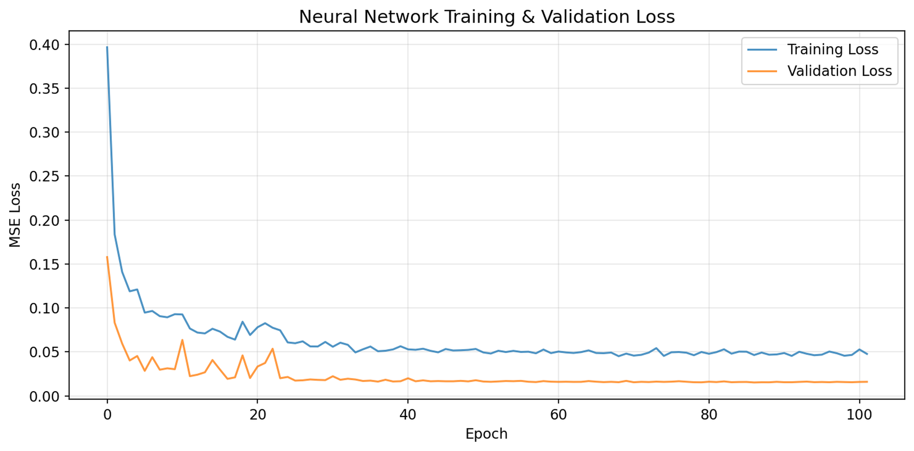

<em>Figure 10: Neural network training and validation loss curves over epochs.</em>

**Discussion:**

The loss curves show rapid initial convergence within the first ~20 epochs, followed by gradual refinement. Training and validation losses track closely, indicating minimal overfitting. The early stopping mechanism activated at epoch 102, preserving the model state with the best validation loss.

### 14.3 Test Set Performance

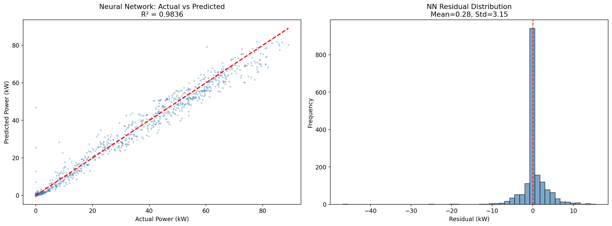

<em>Figure 11: Neural Network — actual vs predicted scatter plot (left) and residual distribution (right).</em>

| Metric | Value |
|---|---|
| R² Score | 98.36% |
| RMSE (kW) | 3.17 |
| MAE (kW) | 1.72 |

**Discussion:**

The neural network achieves exceptional predictive accuracy: R² = 98.36%, meaning it explains over 98% of the variance in power output. The scatter plot (left) shows points tightly clustered along the diagonal across the full power range, with far less spread than the linear models.

The residual distribution (right) is tightly centred around zero with mean = 0.28 kW and standard deviation = 3.15 kW. Compared to the linear regression residuals, the NN residuals are substantially smaller and more symmetric, confirming that the non-linear model better captures the true data-generating process.

---

## 15. Model Comparison

All four models are compared on three standard regression metrics: R² (coefficient of determination), RMSE (root mean squared error), and MAE (mean absolute error).

| Model | R² | R² (%) | RMSE (kW) | MAE (kW) |
|---|---|---|---|---|
| Neural Network (Optuna) | 0.9836 | 98.36 | 3.17 | 1.72 |
| LR: Date+POA | 0.8145 | 81.45 | 10.65 | 5.47 |
| LR: POA Only | 0.8110 | 81.10 | 10.75 | 5.41 |
| LR: Date Only | 0.0173 | 1.73 | 24.52 | 21.26 |

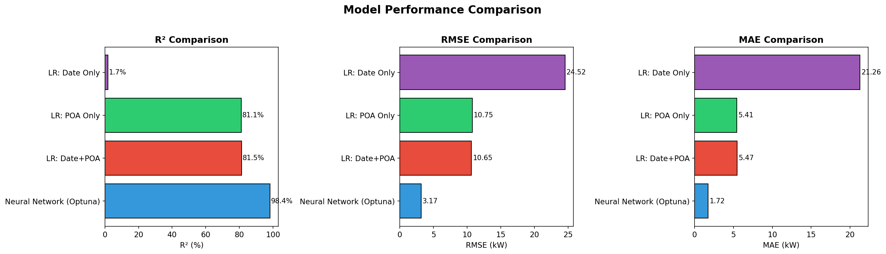

<em>Figure 12: Model comparison — R², RMSE, and MAE across all four models.</em>

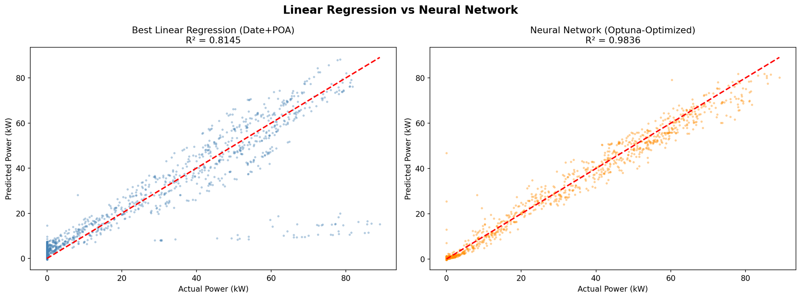

<em>Figure 13: Side-by-side comparison — Best Linear Regression (left) vs Neural Network (right).</em>

**Discussion:**

The neural network dominates all three metrics. It achieves R² = 98.36% compared to the best linear model R² = 81.45% — an improvement of +16.91 percentage points. The RMSE drops from 10.65 kW (linear) to 3.17 kW (NN), a reduction of 7.49 kW.

Figure 13 provides a visual comparison: the NN scatter (right, orange) is noticeably tighter than the linear regression scatter (left, blue), particularly at intermediate and high power values where the linear model shows more residual spread.

Model B (Date features only) confirms that without irradiance information, power prediction is essentially impossible with a linear model (R² = 1.73%). This underscores the critical importance of real-time irradiance data for solar power forecasting.

---

## 16. Key Findings & Conclusions

### Finding 1: POA Irradiance is the Dominant Predictor

With a Pearson correlation of r = 0.8809 and a linear R² of 81.10% using POA alone, plane-of-array irradiance is by far the single most important variable for predicting solar power output.

### Finding 2: Significant Temporal Patterns

ANOVA confirms that hour of day (F = 3,214.6) and month (F = 24.9) significantly affect power output. The two-way interaction (Hour × Month) is also significant (F = 35.24), reflecting how seasonal changes modify the daily generation profile.

### Finding 3: Day of Week Has No Effect

The ANOVA F-statistic for day of week is only 0.07 (p = 0.999), confirming that solar generation is independent of the weekly cycle. This is physically intuitive — the sun does not follow a human work schedule.

### Finding 4: Power Distribution is Non-Normal

The Shapiro-Wilk test rejects normality (p < 0.001), which is expected given the large proportion of zero-power nighttime observations. Non-parametric tests (Kruskal-Wallis, Mann-Whitney) were therefore deployed alongside parametric ones.

### Finding 5: Linear Models Have Limitations

The best linear regression (R² = 81.45%) leaves approximately 18.5% of variance unexplained. Residual analysis reveals systematic non-linear patterns that linear models cannot capture.

### Finding 6: Neural Network Achieves Superior Accuracy

The Optuna-optimized neural network achieves R² = 98.36% with RMSE = 3.17 kW, representing a +16.91% R² improvement and 7.49 kW RMSE reduction over the best linear model. This demonstrates the value of non-linear modelling for solar forecasting.

### Finding 7: Seasonal Variance Heterogeneity

Levene's test confirms unequal variances across seasons. Summer months exhibit greater power output variability due to higher irradiance levels and wider range of possible weather conditions.

### Finding 8: Morning vs Afternoon Asymmetry

The t-test reveals statistically significant differences between morning and afternoon power output, likely due to peak sun position, ambient temperature effects, and panel orientation.

---

## 17. Recommendations

### Recommendation 1: Use the Neural Network for Production Forecasting

The Optuna-optimized NN with 3 hidden layers and 256 units should be deployed for operational power forecasting. Its 98%+ R² and low RMSE make it suitable for grid management and energy trading.

### Recommendation 2: Incorporate Weather Forecast Data

Future work should integrate weather forecast data (cloud cover, temperature, humidity) to further improve predictions, particularly for multi-hour-ahead forecasts where real-time POA is unavailable.

### Recommendation 3: Consider Ensemble Methods

Combining the NN with gradient boosting (XGBoost, LightGBM) in an ensemble may yield marginal improvements and increase prediction robustness.

### Recommendation 4: Periodic Model Retraining

As panel degradation occurs over time, the model should be retrained periodically (e.g., quarterly) to maintain accuracy. Monitoring for concept drift is recommended.

### Recommendation 5: Expand Temporal Coverage

Extending the dataset beyond 13 months would improve seasonal modelling and enable more robust cross-validation across multiple annual cycles.

---

*End of Report*
